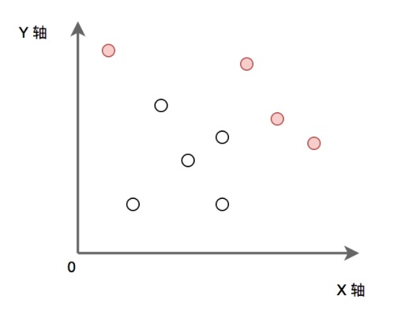

# Description:
Given a set of points, find all the Pareto points with no other points larger than itself in X and Y axis:

# Solution:
1. Sort points by X axis in descending order.
- Iterate from the beginning, maintain a maximum Y value. 
- Push the points with larger Y into results. Finally print the results.